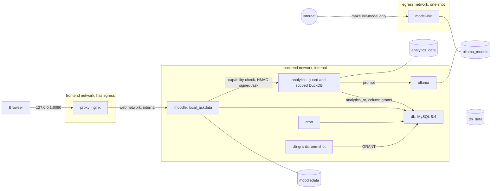

# Moodle local analytics stack

Demo stack for the talk "Your data, your infrastructure: local AI and open-source analytics for Moodle". It runs Moodle 5.3, exports a pseudonymised subset of its data to DuckDB, and lets a teacher ask questions about their courses in plain English. A local Ollama model writes the SQL, a guard checks it, and DuckDB runs it on the teacher's courses only. At runtime no container that touches the data can reach the internet.

| Promise | How it is proven |
|---|---|
| Moodle data is exported to DuckDB (and optionally Parquet) | `make export` prints row counts. `test_parquet_mode_matches_duckdb_mode` in `analytics/tests/test_integration.py` checks that both formats give the same tables, columns and row counts. |
| A local Ollama model writes the SQL | `make ask Q="..."` and `make bench`. Results with timings are in [docs/benchmark.md](docs/benchmark.md). |
| Exploration runs over curated, pseudonymised views | `test_schema_is_documented_and_free_of_personal_data` (no name, email or username columns, salt not in the file) and the "Database grants" section of `make smoke` (the exporter cannot read `mdl_user.password`, emails or names). |
| Nothing leaves the infrastructure at runtime | The "Egress matrix" section of `make smoke` and `analytics/tests/test_isolation.py`: DNS and direct IP connections to the internet fail from moodle, cron, db, analytics and ollama. |

## Contents

1. [Architecture](#architecture)
2. [Quick start](#quick-start)
3. [Hardware and model choice](#hardware-and-model-choice)
4. [Security model](#security-model)
5. [The six demo questions](#the-six-demo-questions)
6. [Adding example questions](#adding-example-questions)
7. [DuckDB or Parquet](#duckdb-or-parquet)
8. [Keeping the demo fresh](#keeping-the-demo-fresh)
9. [Make targets](#make-targets)
10. [Known limits and what was not verified](#known-limits-and-what-was-not-verified)
11. [Repository layout](#repository-layout)
12. [License](#license)

## Architecture



A question takes this path:

1. The browser talks only to the nginx `proxy`, the one container with a published port (loopback only).
2. The proxy forwards to Moodle over the internal `web` network. The `local_askdata` plugin checks `local/askdata:ask`, works out which courses the user teaches, and signs the request with HMAC-SHA256.
3. The `analytics` service verifies the signature, copies only those courses into a private in-memory DuckDB, and asks `ollama` for SQL.
4. The SQL guard checks the query, DuckDB runs it, and Moodle shows the SQL, the table and the elapsed time.

| Network | Internal | Members |
|---|---|---|
| `frontend` | no | proxy |
| `web` | yes | proxy, moodle |
| `backend` | yes, subnet `BACKEND_SUBNET` (default `172.28.0.0/24`) | moodle, cron, db, db-grants, analytics, ollama |
| `egress` | no | model-init (profile `init`, runs only for `make init-model`) |

Volumes: `db_data`, `moodledata`, `phpunitdata`, `analytics_data`, `ollama_models`.

Pinned versions: Moodle `v5.3.0`, `moodlehq/moodle-php-apache:8.3-bookworm` (by digest), `mysql:8.4.11`, `nginx:1.30.5-alpine`, `ollama/ollama:0.35.1`, `python:3.12.15-slim`, DuckDB 1.5.6, sqlglot 30.21.0, FastAPI 0.142.2, Composer 2.10.3. The plugin needs Moodle 5.1 or later and was only tested against 5.3. Reasons for each pin are in [docs/PLAN.md](docs/PLAN.md).

## Quick start

### Prerequisites

- Docker with Compose v2. Developed with Docker 23.0.5 and Compose v2.17.3.
- Memory: the stack without a loaded model ran in a Docker Desktop VM of 7.67 GB. The model needs more on top, see [Hardware and model choice](#hardware-and-model-choice).
- Disk: about 7 GB of images (the Ollama image alone is 4.2 GB, the Moodle image 1.5 GB) plus the model and data volumes. Plan for 8 to 9 GB with `qwen2.5-coder:1.5b`, more with a larger model.
- `make`, `bash` and `openssl` on the host. Internet access for the build and for `make init-model`.

### Steps

```bash
git clone <repository-url> moodle-local-stack
cd moodle-local-stack
make env
```

`make env` writes `.env` with random secrets (`scripts/gen-env.sh`). Before the next step, pick the model: `OLLAMA_MODEL` in `.env` defaults to `qwen2.5-coder:14b`, which needs about 9 GB of RAM. On a smaller machine set it to `qwen2.5-coder:7b`, `3b` or `1.5b` (see the table below). Change it now, because `make init-model` downloads whatever is set.

```bash
make init-model     # downloads OLLAMA_MODEL, the only step that needs internet at runtime
make up             # builds images, installs Moodle, starts everything
make demo-data      # five courses, 100 students, three teachers, then an export
```

Then open http://localhost:8080 and log in as `lmartinez` with the password in `DEMO_USER_PASSWORD` in `.env` (default `Demo.Teacher.2026`). Open the course "Data Analysis 101", then More, then "Ask your data".

From the terminal:

```bash
make ask Q="Which students have not logged in for 14 days?"   # every course in the export
make ask Q="..." COURSES=2,3,4                                  # lmartinez's courses
make bench    # six demo questions plus paraphrases, rewrites docs/benchmark.md
make smoke    # isolation, auth, scoping and plugin checks against the running stack
make test     # analytics pytest, then the plugin PHPUnit suite
```

### Expected durations

Measured on the development machine (Apple M1 Pro, Docker VM with 5 CPUs and 7.67 GB).

| Step | Time |
|---|---|
| `make init-model`, first pull of the `ollama/ollama` image (4.2 GB) | about 11 min |
| `make init-model`, `qwen2.5-coder:1.5b` (986 MB) | 95 s |
| Moodle image build (clone 64 s plus Composer) | about 1 min 53 s |
| `make up` until Apache serves Moodle (unattended install takes 107 s) | 127 s |
| `make demo-data` (generator 13 s, variety script 26 s); a re-run | 41 s; 3 s |
| Export to DuckDB / to Parquet | 0.3 to 0.6 s / about 0.6 s |
| `make test-plugin` (28 tests, 91 assertions); first run including init | about 35 s; 1 min 53 s |

Results on that machine: analytics tests 243 passed, 2 skipped. `make smoke` 52 PASS, 0 FAIL, 3 SKIP. All three skips came from the model not loading for lack of memory while the full stack was up.

## Hardware and model choice

Ollama runs on CPU by default. `make up OLLAMA_PROFILE=gpu` starts `ollama-gpu` with an NVIDIA device reservation instead; it has not been tested because no NVIDIA GPU was available.

On Apple Silicon, Docker cannot use the Mac GPU, so Ollama inside Docker is CPU only on a Mac.

| Model | Approximate memory | Measured here |
|---|---|---|
| `qwen2.5-coder:1.5b` | 986 MB on disk, 1.5 GB loaded with `num_ctx` 8192 | yes |
| `qwen2.5-coder:3b` | about 2.3 GB | no |
| `qwen2.5-coder:7b` | about 4.7 GB | no |
| `qwen2.5-coder:14b` (default in `.env.example`) | about 9 GB | no |

On the development machine even the 1.5b model was killed by the kernel while db, moodle and cron were running: the Docker VM had about 1.7 GB free. `/ask` then returns 502 `model_unavailable` and the plugin shows a message asking the administrator to check the Ollama service. The benchmark was taken with this project's db, moodle and cron containers stopped for a moment.

Ollama does not warn about this. It reports the VM's total memory as free and tries to load anyway, so an out-of-memory load shows up as a killed runner.

For the 7b model next to the full stack, give Docker Desktop around 16 GB (Settings, Resources, Memory). That figure is an estimate and was not tested.

## Security model

Full details and the reasoning are in [docs/security.md](docs/security.md).

- Only the proxy is on a network with internet access. Moodle, cron, db, analytics and ollama are on internal networks only, and `make smoke` checks that DNS and direct IP connections to the internet fail from each of them.
- The model is downloaded by `model-init`, the only container on `egress`, which is never attached to `backend`.
- Scoping happens twice. Moodle sends only the courses where the user holds `local/askdata:ask`, minus suspended or expired enrolments and hidden courses the user cannot see. The analytics service then copies only those courses into a private in-memory DuckDB, so other courses do not exist on the connection the model's SQL runs on.
- The SQL guard (sqlglot) accepts one read-only statement over the allowed views, rejects qualified names, system schemas and file, network or introspection functions, and adds a row cap.
- The DuckDB connection has external access disabled, a locked configuration, a 512 MB memory limit, no spilling to disk and a 30 s query timeout.
- Every request from Moodle is signed with HMAC-SHA256 over the timestamp and raw body. Requests outside a 300 s window are rejected. The secret never reaches the browser.
- The exporter connects as `analytics_ro`, with column-level `SELECT` on the exported columns only. The one-shot `db-grants` service revokes and re-applies these grants on every `make up`.
- `user_ref` is `sha256(userid || ANALYTICS_SALT)`. This is pseudonymisation, not anonymisation: anyone with the salt can recompute every `user_ref`.
- Moodle stores the full question text in its log (`\local_askdata\event\question_asked`). The analytics service logs it only at DEBUG.

## The six demo questions

Expected answers are for teacher `lmartinez` (courses DA101, PROG101, STAT201), from [docs/demo-data.md](docs/demo-data.md), which also has the figures for all five courses. Times are from [docs/benchmark.md](docs/benchmark.md): `qwen2.5-coder:1.5b`, CPU only, Apple M1 Pro, one run each after a warm-up, all six correct on the first attempt.

| # | Question | Expected answer | Time |
|---|---|---|---|
| 1 | Which courses do I teach, and how many students are in each? | DA101 95, PROG101 85, STAT201 75 students | 9.0 s |
| 2 | Which students have not logged in for 14 days? | DA101 23, PROG101 20, STAT201 25 (68 rows). 25 distinct students across all five courses, 5 of them never logged in. | 10.0 s |
| 3 | Who has not submitted the assignment due this week? | Final Project: DA101 28, PROG101 32, STAT201 41 not submitted | 13.0 s |
| 4 | What is the average grade for each graded item in my course? | Problem Set 1 / Checkpoint quiz: DA101 72.5 / 80.7, PROG101 66.6 / 74.1, STAT201 52.2 / 67.6 | 11.3 s |
| 5 | Which activity has the highest drop-off? | STAT201 "Unit 2: Regression modelling", 85.3% to 14.7%, a drop of 70.6 points | 27.2 s |
| 6 | Compare completion across my courses and explain the differences | DA101 70.5%, PROG101 55.3%, STAT201 10.7%. STAT201 has the Unit 2 cliff and a third of its students inactive. | 30.4 s |

Repeating a question while the model is warm took about 3.3 s.

The six questions are also few-shot examples, so the model can copy their SQL. The paraphrase set in the benchmark is the honest test: 5 of 6 correct. The paraphrase of question 5 ("At which step of the course path do we lose the most students?") failed twice in the guard and returned 422. For question 6 the service returns the numbers that support an explanation; it does not write the explanation itself.

## Adding example questions

Examples live in `analytics/examples.yaml`:

```yaml
- id: not_logged_in_14
  question: Which students have not logged in for 14 days?
  tags: [inactive, login, students, list]
  sql: |
    SELECT ...
```

For each question the service picks the `EXAMPLES_TOP_K` examples (default 6, `0` turns them off) whose words overlap most with the question and its tags, and puts the closest one last in the prompt. Each example adds tokens that Ollama evaluates again on every request, so a higher value costs latency on CPU.

`analytics/tests/test_examples.py` checks every example: it must pass the SQL guard and return rows on the demo export. The same file requires 15 to 20 examples (there are 19 now), unique ids, and the six talk questions with their exact wording. Keep the `id` of those six stable: they are both the benchmark questions and examples, and the benchmark checks its answers against them.

The file is copied into the analytics image, so rebuild after editing it:

```bash
make up              # rebuilds and recreates analytics
make test-analytics
```

## DuckDB or Parquet

Set `EXPORT_FORMAT` in `.env` to `duckdb` (default) or `parquet`, then run `make up` and `make export`.

| | `duckdb` | `parquet` |
|---|---|---|
| Reads MySQL with | DuckDB `mysql_scanner`, installed at build time | PyMySQL, only the whitelisted columns |
| Writes | `/data/moodle.duckdb` | `/data/moodle.duckdb` and `/data/parquet/<table>.parquet` |

Both modes produce the same tables, columns and row counts (`test_parquet_mode_matches_duckdb_mode`). `/ask` always queries `moodle.duckdb`; the Parquet files are a copy for other tools. The files sit on the `analytics_data` volume. To copy them out:

```bash
docker compose cp analytics:/data/parquet ./parquet-export
```

There is one file per table (`course`, `participant`, `daily_activity`, `activity`, `completion`, `course_completion`, `grade_item`, `grade`, `assignment_submission`) plus `export_meta`. An export in `duckdb` mode does not touch `/data/parquet`, so files left from an earlier Parquet run go stale; `export_meta.parquet` says when they were written.

## Keeping the demo fresh

The demo dates are relative to the moment `make demo-data` ran, but live answers compute "days since last access" from the export time. After a few days some students cross the 14-day line and the answers drift from [docs/demo-data.md](docs/demo-data.md). `make test` is not affected: it exports "as of" the generation time.

`make demo-data` prints how old the data is and warns when it is older than 3 days.

`make demo-reset` deletes this stack's Moodle, MySQL and export volumes, reinstalls Moodle, waits for analytics, and runs the demo data again. It keeps the Ollama model volume and gives you 10 seconds to press Ctrl-C. Run it within 3 days before the talk.

`make clean` is different: it also deletes the downloaded model.

## Make targets

| Target | What it does |
|---|---|
| `make help` | List the targets |
| `make env` | Create `.env` with random secrets if missing; refuse `changeme` placeholders |
| `make build` | Build the images |
| `make up` | Start the stack, install Moodle on the first run (`OLLAMA_PROFILE=gpu` for NVIDIA) |
| `make down` | Stop the stack, keep the volumes |
| `make logs` | Follow the logs of all services |
| `make clean` | Stop the stack and delete every volume, the model included |
| `make init-model` | Download `OLLAMA_MODEL` into the models volume (needs internet) |
| `make demo-data` | Generate the demo courses and users, then export |
| `make demo-reset` | Delete Moodle, MySQL and export data, reinstall, regenerate the demo; keeps the model |
| `make configure-plugin` | Set the `local_askdata` settings and open Moodle curl security for the backend subnet |
| `make export` | Export Moodle data now and print row counts |
| `make sql Q="SELECT ..."` | Read-only query on the export |
| `make ask Q="..." [COURSES=2,3,4]` | Ask a question from the terminal |
| `make bench` | Run the demo questions and paraphrases, rewrite `docs/benchmark.md` |
| `make test` | Run `test-analytics` and `test-plugin` |
| `make test-analytics` | Analytics unit and integration tests inside the container |
| `make test-plugin` | `local_askdata` PHPUnit tests inside the moodle container |
| `make smoke` | End-to-end checks against the running stack, plus the host-side isolation test when `analytics/.venv` exists |

`make bench` overwrites the hand-written notes at the end of `docs/benchmark.md`.

## Known limits and what was not verified

Not verified:

- `qwen2.5-coder:7b` and `14b` on the development machine. Its Docker VM has 7.67 GB with about 1.7 GB free while the stack runs; even 1.5b was killed by the kernel with db and moodle up.
- The `gpu` profile. No NVIDIA GPU was available.
- x86_64. Everything was built and run on arm64. The pinned images are multi-arch.
- A full run from a clean machine in one go. Each phase was verified on its own, and `make demo-reset` was only dry-run.
- The 16 GB Docker Desktop advice for 7b is an estimate.

Known limits:

- The service does not write the explanation text that question 6 asks for. It returns the numbers; the plugin shows SQL and table only.
- Small models sometimes fail on paraphrased questions, or return valid SQL that answers a slightly different question. Every answer shows its SQL so a person can check it.
- The question text is stored in Moodle's standard log.
- The proxy has egress by design. It only forwards to Moodle, but a compromised proxy would have a route out.
- A signed request can be replayed within the 300 s window. There is no nonce store.
- `/schema` and `/health` are unauthenticated. They are only reachable on `backend` and hold no row data.
- A Moodle administrator can reopen curl security in the admin UI and let Moodle reach other hosts.

Deliberate changes from the original brief:

- An nginx proxy fronts Moodle, because Docker publishes ports only on non-internal networks and Moodle must not have egress.
- `user_ref` uses sha256 instead of md5.
- Database access uses column-level grants applied by the one-shot `db-grants` service.
- `/refresh` requires the same HMAC signature as `/ask`.
- A second scoping layer copies course-filtered tables into a locked in-memory DuckDB per request.
- `make clean` removes the Ollama model volume; `make demo-reset` keeps it.
- The backend subnet is configurable (`BACKEND_SUBNET`), and `scripts/moodle/configure-askdata.sh` opens Moodle's curl security for exactly that /24.

## Repository layout

```
compose.yaml  Makefile  .env.example  README.md
analytics/            FastAPI service: export, views.sql, guard, ask, CLI, examples.yaml, tests/
docker/db/            analytics_ro grants and the list of exported columns
docker/moodle/        Moodle image, entrypoint, Apache router config
docker/proxy/         nginx config
plugin/local_askdata/ Moodle plugin: "Ask your data" page and signed service client
scripts/              .env generation, model download, demo data, smoke test
scripts/moodle/       variety.php and configure-askdata.sh, mounted into the moodle container
docs/                 plan, demo data, API, plugin, security, benchmark
```

| Document | Content |
|---|---|
| [docs/PLAN.md](docs/PLAN.md) | Pinned versions, risks, networks, data model rules, phases |
| [docs/demo-data.md](docs/demo-data.md) | How the dataset is built and every expected answer |
| [docs/ask-api.md](docs/ask-api.md) | `/ask`, `/health`, `/schema`, `/refresh`, errors, prompt building |
| [docs/plugin.md](docs/plugin.md) | `local_askdata` in the stack: install, configuration, tests |
| [docs/security.md](docs/security.md) | Security model and its limits |
| [docs/benchmark.md](docs/benchmark.md) | Measured answer times and generated SQL |
| [plugin/local_askdata/README.md](plugin/local_askdata/README.md) | Plugin settings, curl security, security model |

## License

The `local_askdata` plugin is GNU GPL v3 or later, like Moodle. The rest of the repository has no license file yet: choose a license before publishing it.
